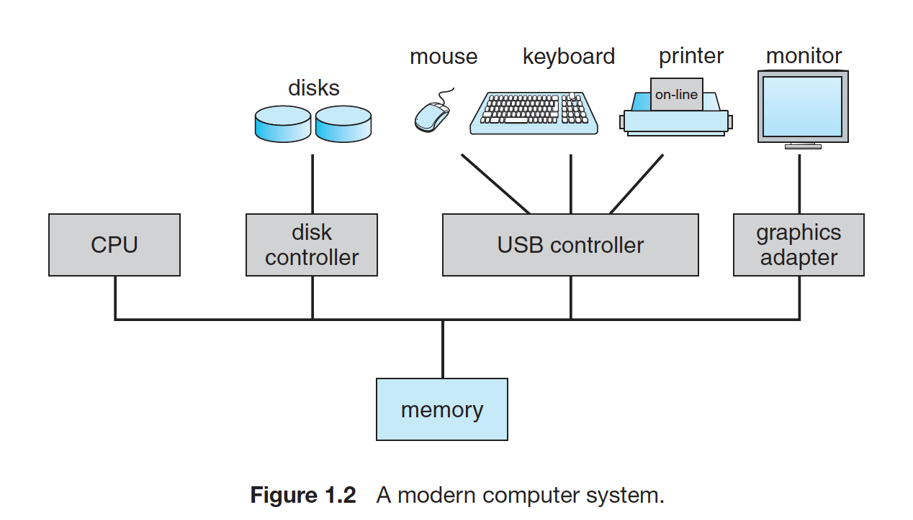
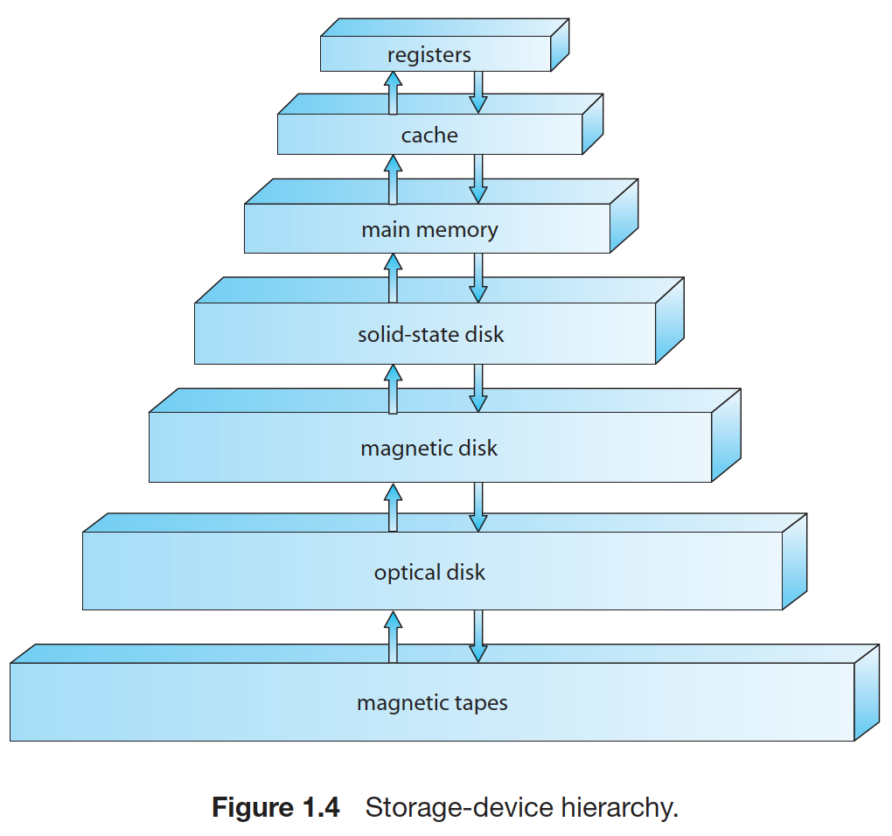
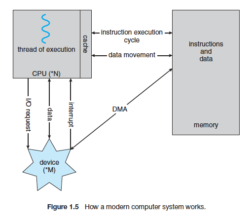
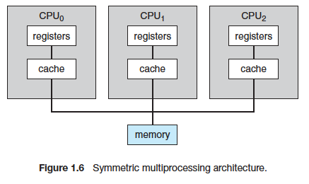
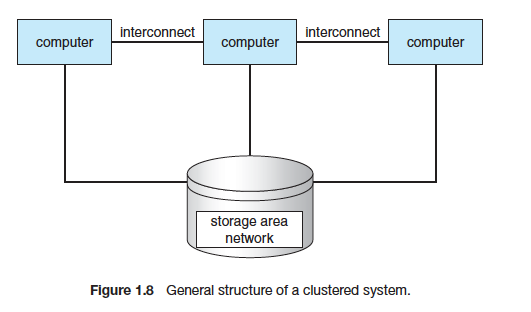
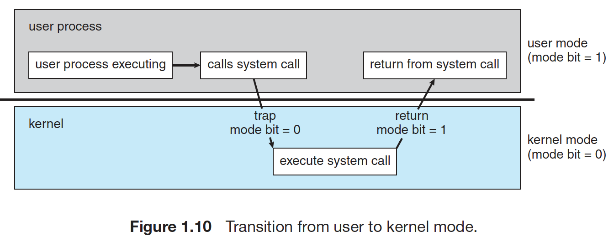
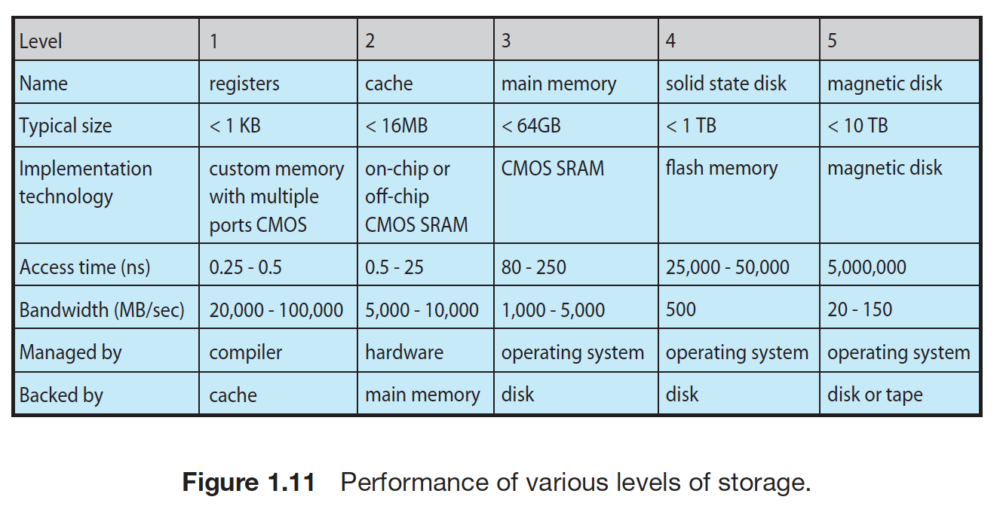
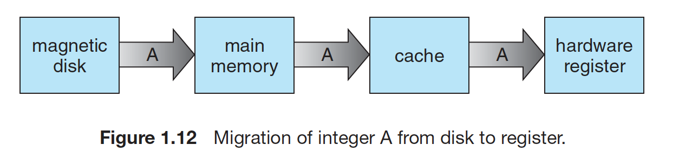
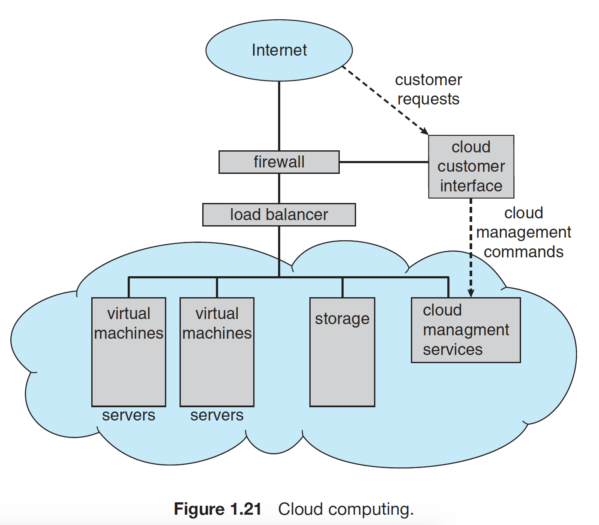

# Introduction

OS: a program that manages a computer's hardware
1. Hardware: Central Processing Unit, Memory, I/O devices
2. OS: control the hardware and coordinates its use among application programs and aimed to maximize resource utilization
3. Application programs: compilers, web browsers, word processors
4. Users

or
1. Hardware
2. Applications
3. Data

**User view**: Resource utilization in single-user experience and multi-users

**System view**:

  `Resource allocator`: decide how to allocate resources(CPU time, memory space, file-storage space, I/O devices.etc) to specific programs and users so that it could operate the computer system efficiently and fairly

  `Control program`: manage the execution of user programs to prevent errors and improper use of the computer

OS is one program running at all times on the computer - usually called the **kernel**

`system programs`: associate with OS but not necessarily part of the kernel

`application programs`: all programs not associate with the operation of system

**Middleware**
a set of software frameworks that provide additional services to application developers (eg: IOS, Android)

# Basic Organization of Computer Systems
A modern computer system

## Computer power-up/reboot
bootstrap program: stored in ROM/EEPROM, initialize all aspects of the system, from CPU registers, device controllers to memory contents. `Load operating system kernel into memory and execute the system`

## Interrupt
`hardware`: by sending a signal to CPU by way of the system bus

`software`: by executing a special operation called a `system call`

## Storage Structure
### Registry and Main Memory
The CPU can load instructions only from main memory, especially RAM. And main memory commonly is implemented in a semiconductor technology called `DRAM`

**Von Neumann Architecture**: fetch an instruction from `memory` and stores that instruction in the `instruction register` --> decode instruction --> (fetch operands from memory and stores in `internal register`) -- > execute instruction, and store result in memory

### Secondary storage
an extension of main memory

`magnetic disk`: provide storage for both program and data

other storage systems: cache memory, CD-ROM, magnetic tapes and so on.

`volatile storage`: above solid-state disk
`nonvolatile storage`: solid-state disk and below

### I/O Structure
To start an I/O operation: `device driver` loads the appropriate registers within the device controller --> `device controller` examines the contents of these registers to determine what action to take --> 'device controller' transfer data from the device to its local buffer --> `device controller` informs the `device driver` with an interrupt that it has finished its operation --> `device driver` return control to `os` returning data

`DMA(Direct Memory Access)`: Transfer an entire block of data to memory with no intervention by the CPU

# Computer-System Architecture

## Single-Processor Systems

## Multiprocessor Systems
also known as parallel system or multicore systems
`Increased throughput`
`Economy of scale`
`Increased reliability` --> graceful degradation/fault tolerant(detect, diagnose and correct if possible failure)

Two types:

`asymmetric multiprocessing`: boss-worker relationship. The boss schedules and allocate work to the worker processors

`symmetric multiprocessing`: all processors are peers

memory access model:
`uniform memory access`: access to any RAM from any CPU takes the same amount of time
`non-uniform memory access`: some parts of memory may take longer to access than other parts

`multicore`: include multiple computing cores on a single chip

`blade servers`: multiple processor boards, I/O boards and networking boards are placed in the same chassis

## Clustered systems
clustered computers share storage and are closely linked via a local-area network LAN or a faster interconnect, such as InfiniBand

`High-availability`: service will continue even if one or more systems in the cluster fail

`asymmetric clustering`: one machine is in hot-standby mode while the other is running the application

`symmetric clustering`: two or more hosts are running applications and are monitoring each other

high-performance computing: can run an application concurrently on all computers in the cluster

Storage-area networks: allow many systems to attach to a pool of storage

# Operating-System Structure
Ability to multiprogram

jobs kept initially on the disk in the job pool --> allocate main memory to jobs

Time sharing(multitasking): CPU executes multiple jobs by switching among them with CPU scheduling and multiprogramming

a program -> load into memory and executing (process) -> finish or need to perform I/O

job scheduling: choose jobs to load into memory

memory management: management programs in memory

CPU scheduling: choose which job run first

To ensure reasonable response time --> swapping, virtual memory

# Operating-System Operations
interrupt driven

## Dual-Mode and Multimode Operation

mode bit: 0/1

user mode: user(1)

kernel mode: kernel(0)

privileged instructions

virtual machine manager(VMM)

## Timer
set to interrupt the computer after a specified period

# Process Management
A program: a passive entity

A process: an active entity

- scheduling process and threads on the computers
- creating and deleting both user and system processes
- suspending and resuming processes
- providing mechanisms for process synchronization
- providing mechanisms for process communication

# Memory Management
main memory: a repository of quickly accessible data shared by the CPU and I/O devices

- keeping track of which parts of memory are currently being used and who is using them
- decide which process and data to move into and out of memory
- allocate and deallocate memory spaces as needed

# Storage Management

## File-System Management
- creating and deleting files
- creating and deleting directories to organize files
- supporting primitives from manipulating files and directories
- mapping files onto secondary storage
- backing up files on stable storage media

## Mass-Storage Management
secondary storage: disks backup main memory

- free-space Management
- storage allocation
- disk scheduling

Tertiary storage: backup of disk data, storage of seldom-use data and long-term archival storage (magnetic tape and their tapes, CD and DVD drives and platters)

## Caching
check cache first, then main memory

and

**Cache Management**
selection of the cache size, a replacement policy,

## I/O systems
I/O subsystem:
- A memory-management component that includes buffering, caching and spooling
- A general device-driver interface
- Drivers for specific hardware devices

# Protection and Security
Ensure that files, memory segments, CPU, and other resources can be operated on by specific processes

## Protection
control the access of processes or users to the resources defined by a computer system

## Security
defend a system from external and internal attacks (viruses, worms, denial-of-service attacks, identify theft)

# Kernel Data Structure

## Lists, Stacks, and Queues
array -> memory

**list**: a collection of data values as a sequence

`Linked list`: items are linked to one another
- Pros: accommodate items of varying sizes and allow easy insertion and deletion of items
- Cons: retrieve a specific item in a list of size n is linear - O(n)

`a singly linked list`: each item points to its successor

`a doubly linked list`: a given item can refer either to its predecessor or to its successor

`a circularly linked list`: the last element in the list refers to the first element, rather than to null

**Stack**: a sequentially ordered data structure that uses the last in, first out(LIFO) -- often used to invoke function calls

**Queue**: First in, First out(FIFO)

## Trees
represent data hierarchically

`binary tree`: a parent may have at most two children

`binary search tree`: additionally requires an ordering between the parents' two children in which left_child <= right_child  --> The worst-case performance is O(n)

`balanced binary search tree`: worst-case performance of O(lg n)

## Hash Functions and Maps
Take data as its input, performs a numeric operation on this data, and returns a numeric value. This numeric value can be used as an index into a table to quickly retrieve the data --> O(1)

`hash collision`: two inputs result in the same output value --> have a linked list at that table location that contains all of the items with the same hash value

hash map: associate [key:value] pairs using a hash function

## Bitmaps
a string of n binary digits that can be used to represent the status of n items  --> there is a need to represent the availability of large number of resource

# Computing Environments

## Traditional Computing

## Mobile Computing

## Distributed Systems

## Client-Server Computing

## Peer-to-Peer Computing

## Virtualization

## Cloud Computing

## Real-time Embedded Systems

